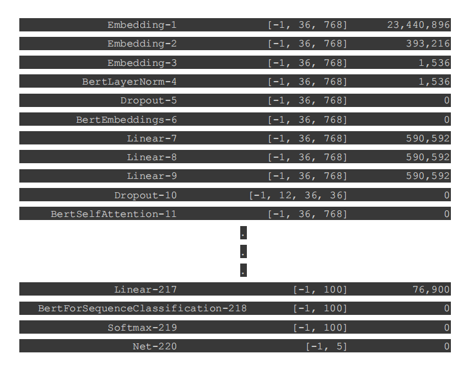
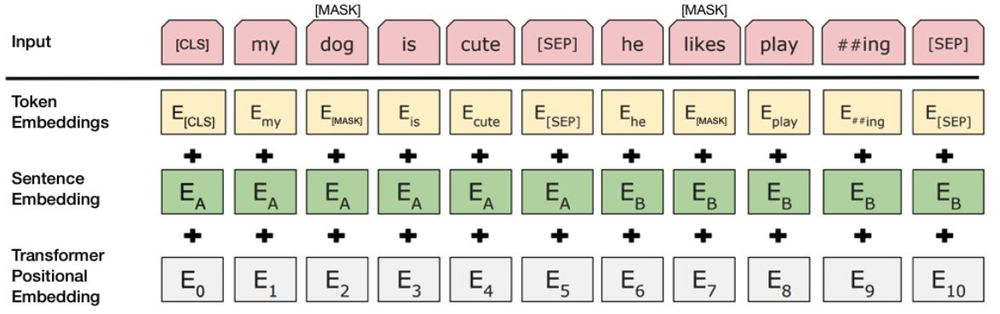

# Quick Reply

## Table of Contents

-   [About](#about)
-   [Getting Started](#getting_started)
-   [Usage](#usage)

## About <a name = "about"></a>

Automated Response Suggestion For Email

---

## Getting Started <a name = "getting_started"></a>

### Prerequisites

```
-   Python 3.7
-   Numpy
-   ImapLib
-   Tensorflow
-   Sklearn
-   Pytorch
-   Pretrained Bert
```

---

### Installing

1. Clone this repository
2. Install required packages

---

## **Usage <a name = "usage"></a>**

## Current solution

Triggering module


---

Reply Suggestion


---

## Model used (BERT)



---

## Fine tuning



---

## Findings

-   The reply that is suggested in basic situations is found to be desirable.
-   Emojis and other unrecognisable characters had to be ignored for the process of this model.
-   The time taken to train the model was very high even for the limited dataset that was
    provided, so for a bigger more encompassing model, the time and hardware required to train
    the model will be very high.

## Future Work

A few improvements and updations that we would like to make to our project, given an opportunity,
are -

-   Deploying the model on Mail Server - We hope to make a chrome extension or some other
    sort of supportive software that can help us deploy this working model on the mail server so
    only the generated replies need to be sent.
-   Train the model according to the personal user - We want to make the model so that it can
    be trained for each user separately taking into account their choice of words and preferences.
    The current solution is lacking in this field as it uses a single pretrained model to give
    answers for any user.
-   Increase the Computing power - We can hope to use much more powerful hardware to
    increase the computing power of the model to increase the database that we can process and
    hence increase the accuracy and likelihood of the response generated to be used.
-   Increase the Database - The software would be much more accurate and the replies would be
    much more likely to be used if a larger database of professional conversations was available
    for us to train the database.
